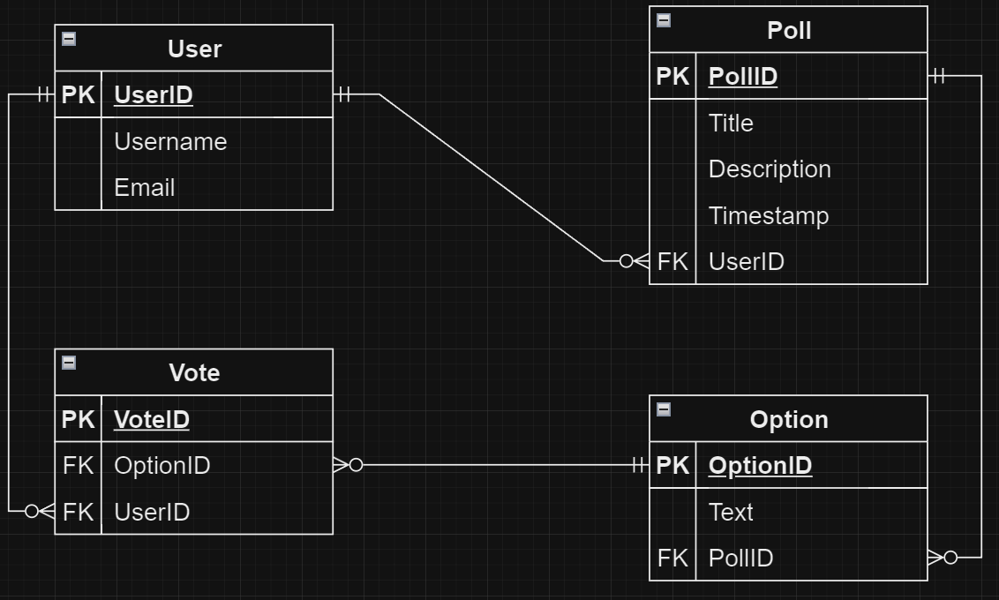

Github Repo: https://github.com/mcbolin22/T2A2/tree/main/Desktop/Coder%20Academy/ColinHill_T2A2/Source%20Code

**R1	Identification of the problem you are trying to solve by building this particular app.**

Surveying a group of people, regardless of size, typically involves creating a poll, spreadsheet or a web form, this API takes the time-consuming and error prone hassle out of that. Simply sending a url to everyone you need to hear from and effortlessly getting those results back from another url.

**R2	Why is it a problem that needs solving?**

Poll creation and distribution is a time-consuming, error-prone endeavour that has limited reach and difficulty analysing results without some form of automation.

Creating polls from scratch, then distributing them and then on top of that collecting and analysing the results is a very tedious process particularly for a large audience. When distributing the poll in paper or email form its also not as efficient as having a centralised link to input your details and make your choice on the poll. When collecting the responses in which ever form they are in will require extra steps to manually enter data from paper polls or emails and can lead to errors and is not the most time efficient venture.

A poll making API streamlines these considerations by automation and facilitating analysis and data accuracy without extra steps where human error could be introduced. An API improves efficiency, accuracy, and reach when gathering opinions and data.
   
**R3	Why have you chosen this database system. What are the drawbacks compared to others?**

PostgreSQL was the appropriate choice for my API due to the following advantages:

Robustness and Scalability: PostgreSQL allows for larger datasets and can efficiently manage the data.

ACID Compliance: This ensures data integrity and consistency. Every vote is reliably stored and reflected in the results leading to more accurate poll results.

Feature Rich: PostgreSQL itself enhances scalability due to various features that can enhance the API. An example of this would be leveraging stored procedures to automate complex polling logic or utilising triggers to enforce data validation rules as the API becomes more sophisticated.

Open source and free: PostgreSQL will ensure usability without licensing which ensures the API's database is always working and manageable.

The drawbacks however are apparent when comparisons are made with alternatives such as NoSQL.

NoSQL is a more appropriate database for a simpler polling API due to potentially faster write speeds and easier schema changes. However, the disadvantages such as lack of robust data querying capabilities and ACID compliance means that PostgreSQL is the more appropriate database to use for complex polls with intricate logic or advanced filtering results.

**R4	Identify and discuss the key functionalities and benefits of an ORM**

**Functionalities:**

- Object-Relational Mapping: The core functionality. It defines how your program's objects map to database tables and how object properties correspond to database columns. This allows you to interact with data using object-oriented syntax instead of writing raw SQL queries.

- CRUD Operations: ORMs provide methods for performing Create, Read, Update, and Delete (CRUD) operations on your data objects. These methods handle the underlying SQL generation and database interaction, saving you time and effort.

- Object-Relational Impedance Mismatch Management: Relational databases store data in tables with rows and columns, while object-oriented programming uses objects with properties and methods. ORMs manage this mismatch by automatically translating between the two structures.

- Data Validation: Many ORMs allow you to define validation rules within your object definitions. This helps ensure data integrity by catching invalid data before it's persisted to the database.

- Relationship Management: Relational databases excel at representing relationships between data. ORMs simplify managing these relationships by automatically translating object associations into appropriate database joins and foreign key constraints.

- Query Building: While some ORMs focus on high-level object interactions, others offer functionalities for building more complex SQL queries when needed. This provides flexibility for specific use cases.

**Benefits:**

- Increased Developer Productivity: Using object-oriented syntax instead of raw SQL simplifies data access logic and reduces boilerplate code. Developers can focus on application logic rather than low-level database interactions.

- Improved Code Maintainability: Object-oriented code tends to be more readable and maintainable compared to raw SQL. This is especially true for complex queries, making it easier to understand and modify code in the future.

- Reduced Errors: ORMs can help prevent SQL injection attacks by automatically sanitizing user input before building database queries. This improves application security.

- Database Independence: Many ORMs support multiple database systems. By using an ORM with a well-defined mapping layer, you can potentially switch between database backends with minimal code changes. This provides flexibility for future needs.

- Object-Oriented Data Representation: ORMs naturally align with object-oriented programming paradigms. This promotes a clean separation of concerns and simplifies data modeling within your application.

**R5	Document all endpoints for your API**

| Endpoint URL | HTTP Method | Description | Authentication |
|---|---|---|---|---|
| /user/register | POST | Register a new user | None |
| /user/login | POST | Log in a user (email validation only) | None |
| /users | GET | Get all users | JWT (admin) |
| /users/<int:user_id> | GET | Get a user by ID | JWT (admin or self) |
| /users/<int:user_id> | DELETE | Delete a user by ID | JWT (admin) |
| /polls | GET | Get all polls |  |
| /polls/<int:poll_id> | GET | Get a poll by ID | JWT |
| /polls/<int:poll_id>/results | GET | Get poll results (vote counts) | JWT |
| /polls | POST | Create a new poll | JWT |
| /polls/<int:poll_id> | PUT | Update a poll | JWT |
| /polls/<int:poll_id> | DELETE | Delete a poll | JWT (creator or admin) |
| /polls/<int:poll_id>/options | POST | Create a new poll option | JWT (creator or admin) |
| /polls/<int:poll_id>/options/<int:option_id> | DELETE | Delete a poll option | JWT (creator or admin) |
| /polls/<int:poll_id>/vote | POST | Cast a vote in a poll | JWT |

**R6	An ERD for your app**

**R7	Detail any third party services that your app will use**

Web Framework: Flask
Database: SQLAlchemy, psycopg2 and PostgreSQL
Authentication: JSON Web Token (JWT) and bcrypt
Data Serialisation: Marshmallow and Marshmallow_SQLAlchemy

**R8	Describe your projects models in terms of the relationships they have with each other**

User: This model represents a user of the system
Poll: This model represents a poll created by a user
Option: This model represents an option to consider by a user in a poll
Vote: This model represents a vote on an option by a user in a poll

Relationships:
User to Poll: One-to-many relationship connected through a foreign key within Poll. One user can create many polls but a poll belongs to one user.

Poll to Option: One-to-many relationship connected through a foreign key within Option. One poll can have many options but an option belongs to only one poll.

Poll to User (through Vote): Many-to-many relationship connected through a foreign key within Vote acting as a bridge between User and Poll without directly connecting them. A poll can have many votes cast by different users, and a user can cast votes on many polls.

Vote to Option: Many-to-one relationship connected through a foreign key within Vote. Many votes can be cast for a single option, but a vote is cast for only one option.

So using an example:

- One User (User A) created the Poll. (one-to-many)
- The Poll has two Options ("Option 1" and "Option 2"). (one-to-many)
- Two Votes were cast (one by User A and another by User B). (one-to-many for User and Vote)
- Each Vote is for a specific Option within the Poll. (many-to-one for Vote and Option)

**R9	Discuss the database relations to be implemented in your application**

**Core Tables**

- User: This table represents a user and has attributes like User ID (primary key), Username (unique) and Email (unique) (Password not required to use this API).
- Poll: This table represents a poll and has attributes like Poll ID (primary key), User ID (foreign key referencing User.User ID - one-to-many relationship), Title, Description (optional), and Created At.
- Option: This table represents an option within a poll and has attributes like Option ID (primary key), Poll ID (foreign key referencing Poll.Poll ID - one-to-many relationship), and Text (the content of the option).
- Vote: This table represents a vote cast by a user and has attributes like Vote ID (primary key), Poll ID (foreign key referencing Poll.Poll ID - many-to-many achieved indirectly), Option ID (foreign key referencing Option.Option ID - many-to-one), and User ID (foreign key referencing User.User ID - one-to-many).

**Relationships:**

- User and Poll (One-to-Many): A user can create many polls, but a poll belongs to only one user. This is enforced by the foreign key User ID in the Poll table referencing the primary key User ID in the User table.
- Poll and Option (One-to-Many): A poll can have many options, but an option belongs to only one poll. This is enforced by the foreign key Poll ID in the Option table referencing the primary key Poll ID in the Poll table.
- User and Poll (Many-to-Many achieved indirectly through Vote): A user can vote on many polls, and a poll can have many votes cast by different users. This is achieved through the Vote table. The foreign key User ID in the Vote table references the User table, and the foreign key Poll ID in the Vote table references the Poll table. A single Vote record links a specific User and Poll with the option they voted for (linked through Option ID).

**R10	Describe the way tasks are allocated and tracked in your project**

Using the assessment rubric as the core criteria of the project I utilised Monday.com as a Project Management tool to track them and check them off.

The priority of my tasks were as follows:

1. Have a clear picture as to what the API would do and be used for.
2. Generate an ERD and get the idea approved on Discord.
3. Write the code and ensure that the idea worked as designed in the ERD.
4. Produce this ReadMe document.
5. Fault find ensuring the code was what the rubric specified (ie comments and data sanitisation)

Once the rubric has been completed I was able to put the finishing touches on this ReadMe.

